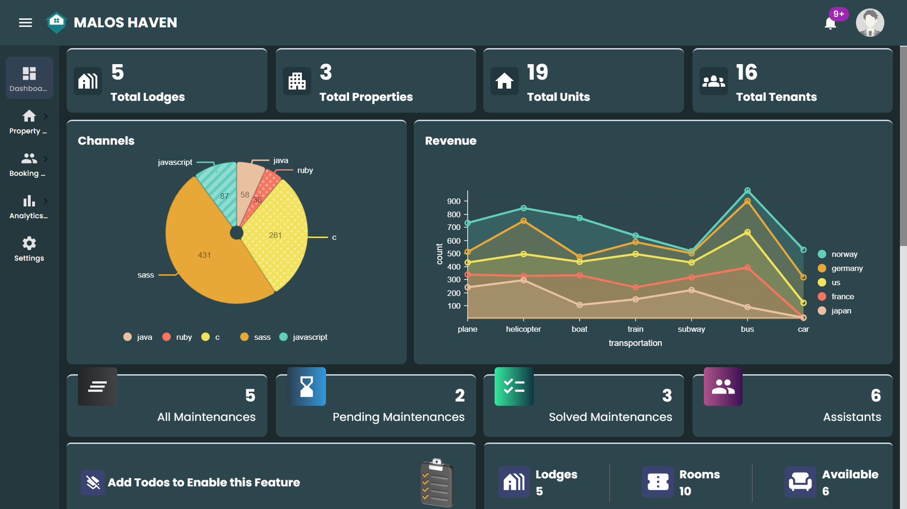
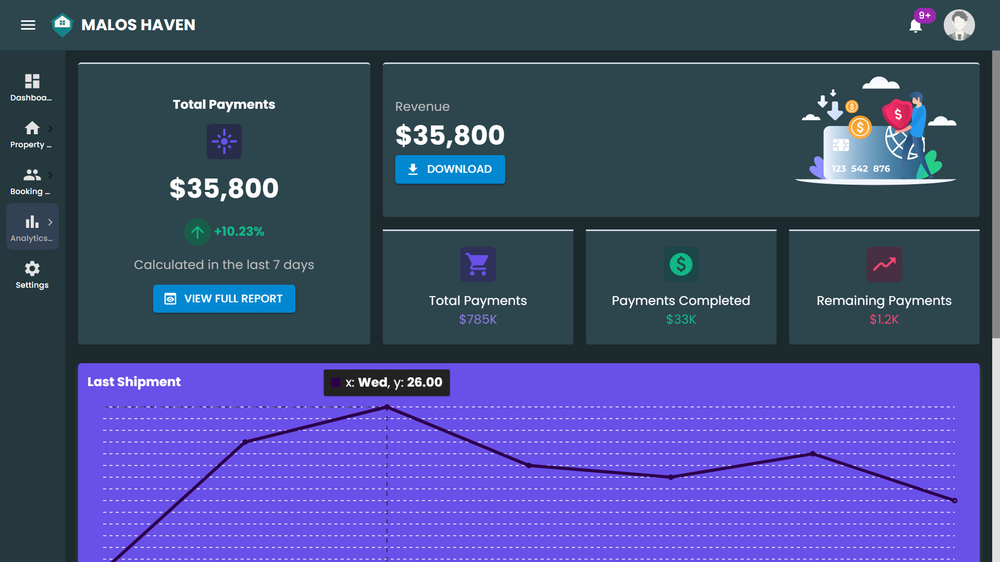

# MALOS Haven

### Property Management System 🏠

## Overview

This is a **Property Management Web Application** built with **React** (frontend) and Supabase.
It is designed to simplify property operations for **owners, tenants, and assistants** — offering tools for rent management, maintenance tracking, and communication.

## Preview

<p>
    
</p>
<p>
    
</p>

## ✨ Features

👤 **Role-based Login System**

- Property Owner: Manage tenants, properties, and assistants
- Tenant: View payment details, receive reminders, and submit maintenance requests
- Assistant: Help manage maintenance and communication between owner and tenants

🏢 **Property Management**

- Add, edit, or remove property listings
- Track occupancy and tenant details

💸 **Rent & Payment Management**

- Send and receive rent reminders automatically
- Track payment history and pending invoices

🛠️ **Maintenance Requests**

- Tenants can easily submit maintenance issues
- Owners or assistants can update status (Pending, In Progress, Completed)

📅 **Reminders & Notifications**

- Automatic notifications for due payments and upcoming maintenance
- Option to send email or in-app alerts

📊 **Dashboard Overview**

- Clear analytics for owners (total rent collected, pending requests, etc.)

📱 **Responsive Design**

- Works seamlessly across desktop and mobile devices

## 🧠 Inspiration

Managing rental properties can quickly become chaotic — from tracking rent payments to handling maintenance requests.  
This app was inspired by the idea of **streamlining property operations** so owners, tenants, and assistants can collaborate efficiently in one platform.

## ⚙️ Tech Stack

- **Frontend:** React.js (Vite or Create React App)
- **Backend:** Supabase (Still Working on the Backend)
- **Database:** PostgreSQL
- **Styling:** Tailwind CSS / CSS Modules
- **Authentication:** Supabase Auth / JWT
- **Hosting:** Currently Vercel

## 🚀 Getting Started

1. Clone the repository

   ```bash
   git clone https://github.com/yourusername/MalosHaven.git
   ```

2. Navigate to the project folder

   ```bash
   cd MalosHaven
   ```

3. Install dependencies

   ```bash
   npm install
   ```

4. Create an `.env` file and add your API keys or credentials

   ```env
   VITE_SUPABASE_URL=your_supabase_url
   VITE_SUPABASE_KEY=your_supabase_key
   ```

5. Run the development server
   ```bash
   npm run dev
   ```

## 💡 Future Improvements

- Add support for online rent payments
- Generate automatic rent receipts and invoices
- Add AI assistant for managing reminders and analytics
- Integrate chat between owners and tenants
- Add push notifications on mobile

## 🧑‍💻 Author

[**Ukobizaba Aimable**](https://ukobizaba-aimable.vercel.app/)
Inspired by the need to simplify property management and improve collaboration between landlords, tenants, and assistants.

---

Made with ❤️ using React and Supabase.
